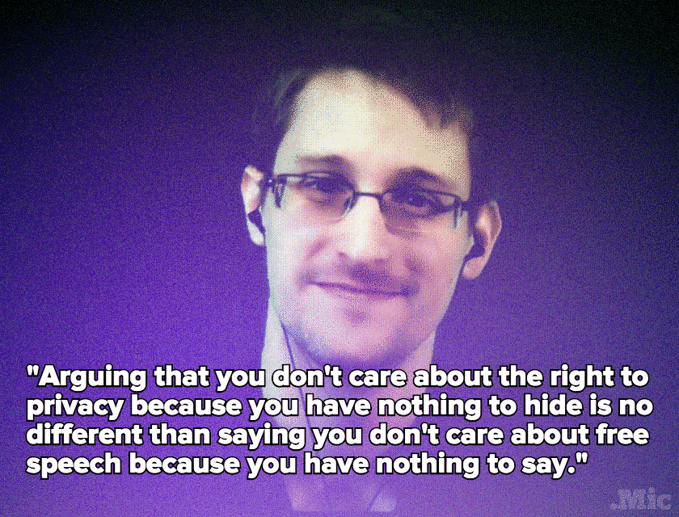

While Edward Snowden may be hiding in Russia, he understands and thinks about the freedoms American's take for granted everyday. In a recent [Reddit AMA](https://www.reddit.com/r/IAmA/comments/36ru89/just_days_left_to_kill_mass_surveillance_under/crglgh2) he succinctly described why he is such a firm believer in privacy, giving his argument against the often heard, _"I don't care if they violate my privacy; I've got nothing to hide"_.

> "Arguing that you don't care about the right to privacy because you have nothing to hide is no different than saying you don't care about free speech because you have nothing to say." Edward Snowden, [Tech.Mic](http://mic.com/articles/119602/in-one-quote-edward-snowden-summed-up-why-our-privacy-is-worth-fighting-for)

The take-a-way from this: **the right to privacy, just like the right to free speech, is fundamental for all Americans.**
