Here it is. It's the end of 2018, and it's time for another in the series of my obligatory year-end music reviews. The following is an alphabetical list of albums that caught, and kept, my attention this year.

## The list

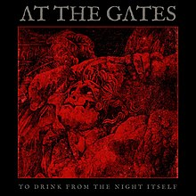
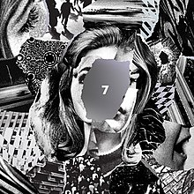
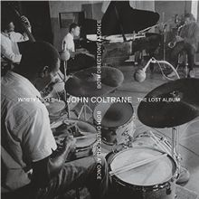

- At The Gates "To Drink From The Night Itself"
- Beach House "7"
- John Coltrane "Both Directions At Once"

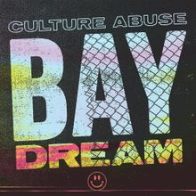
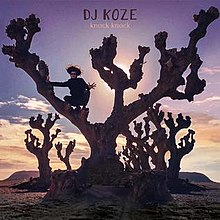
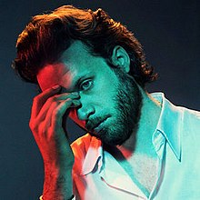

- Culture Abuse "Bay Dream"
- DJ Koze "Knock Knock"
- Father John Misty "God's Favorite Customer"

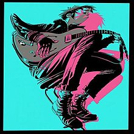
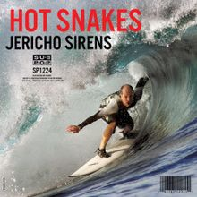
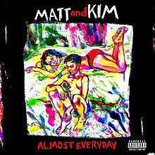

- Gorillaz "The Now Now"
- Hot Snakes "Jericho Sirens"
- Matt and Kim "Almost Everyday"
  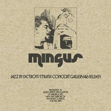
  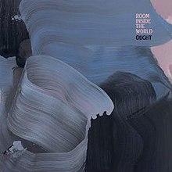
  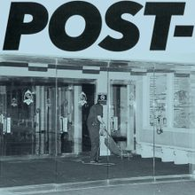

- Charles Mingus "Jazz In Detroit"
- Ought "Room Inside The World"
- Jeff Rosenstock "POST-"

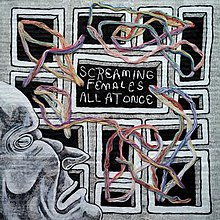
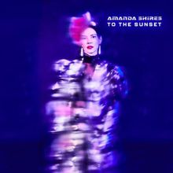
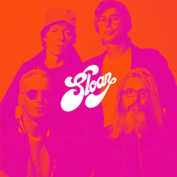

- Screaming Females "All At Once"
- Amanda Shires "To The Sunset"
- Sloan "12"

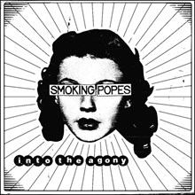
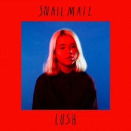
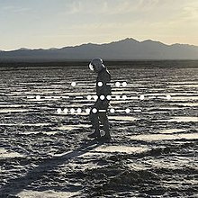

- Smoking Popes "Into The Agony"
- Snail Mail "Lush"
- Spiritualized "And Nothing Hurt"

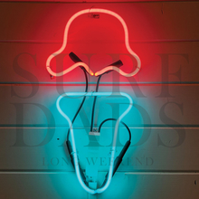
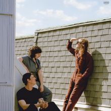
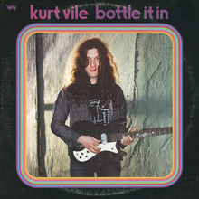

- Surf Dads "Long Weekend"
- Swearin' "Fall Into the Sun"
- Kurt Vile "Bottle it In"

### The honorable mentions

There was a ton of great music that came out this year, many of these I liked but for whatever reason they didn't catch fire as much as the ones above. I list them here for both of our benefit, since I may move some of these up as time goes on. Give em a go, maybe you'll dig them more than I did.

- Neko Case "Hell-On"
- Cloud Nothings "Last Building Burning"
- Courtney Barnett "Tell Me How You Really Feel"
- Deafheaven "Ordinary Corrupt Human Love"
- Dilly Dally "Heaven"
- Guided by Voices "Space Gun"
- Interpol "Marauder"
- Vance Joy "Natoin of Two"
- Kitten Forever "Semi-Permanent"
- Mitski "Be the Cowboy"
- Kacey Musgraves "Golden Hour"
- Nap Eyes "I’m Bad Now"
- Rolling Blackouts Coastal Fever "Hope Downs"
- Shame "Songs of Praise"
- Sleaford Mods "English Tapas"
- Sleep "The Sciences"
- Soccer Mommy "Clean"
- Colter Wall "Songs of the Plains"
- Thom Yorke "Suspiria"

## The shows

Seeing bands live is still one of my favorite things, and wow, this old guy got out to see 25 of them again this year. Didn't plan to match last year's total, but here we are. If I had to pick the best of the year it'd have to be the Jeff Rosenstock show at Off Broadway, which was just such a fun show. Right behind him though is Hot Snakes, which put on an inspired set of noise for faithful. The list of all the shows...

Jonathan Richman w/Tommy Larkin (in Austin, at the Mohawk), Ought with Snail Mail, Hot Snakes, Matt and Kim with Cruisr, Coast Modern, Willie Nelson and Family, The Decemberists, Jeff Rosenstock, U2, Spoon, Vance Joy with Alice Merton, Dropkick Murphies with Flogging Molly, Guided by Voices, Sloan, TWRP with Planet Booty, Jason Isbell and the 400 Unit, Screaming Females with Kitten Forever, Swinging Utters, The English Beat, The Alarm, Cloud Nothings with Nap Eyes, Smoking Popes, Starwolf, Amanda Shires, and Thom Yorke.

## The parting shot

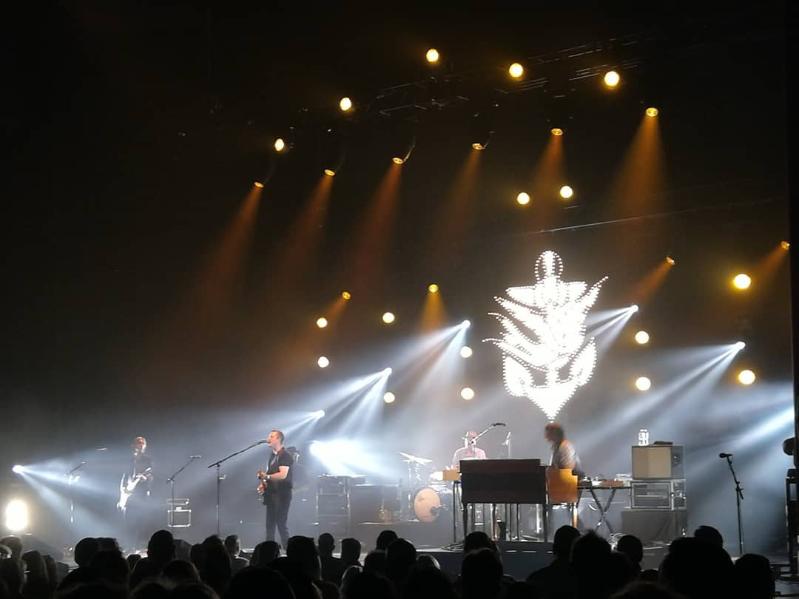

  Jason Isbell and the 400 Unit, Stifel Theatre (Sept 13, 2018)

