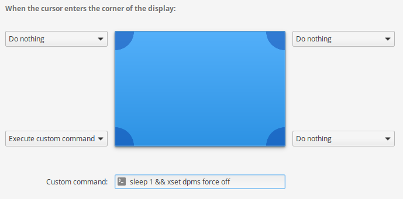

One thing I've gotten used to is using 'hot corners' to invoke actions in the Linux desktop, in the latest version of [Elementary OS](https://elementary.io) I had to find the command to manually do this, but now I have it working. Test this in a terminal and validate that it works for you:

```
xset dpms force off
```

Note: that you'll need to have the screen lock activate as part of the power options (System Settings -> Privacy and Security -> Locking)

Then setup your hot corner (System Settings -> Desktop -> Hot Corners), choose `Execute custom command` in your desired corner and then enter:

```
sleep 1 && xset dpms force off
```

With a sleep so accidental corner touches won't kick it off immediate. After that you should be all set. I like to use the bottom right hot corner, so when a cursor hits that it, it'll turn off the screen and lock, so my setup looks like this:


