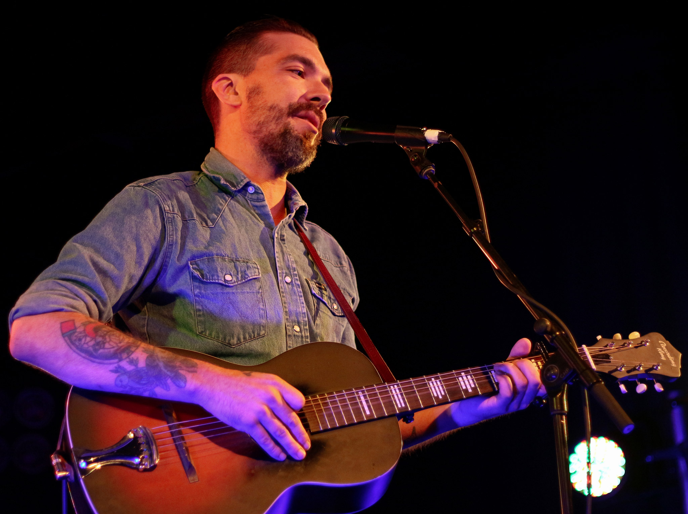
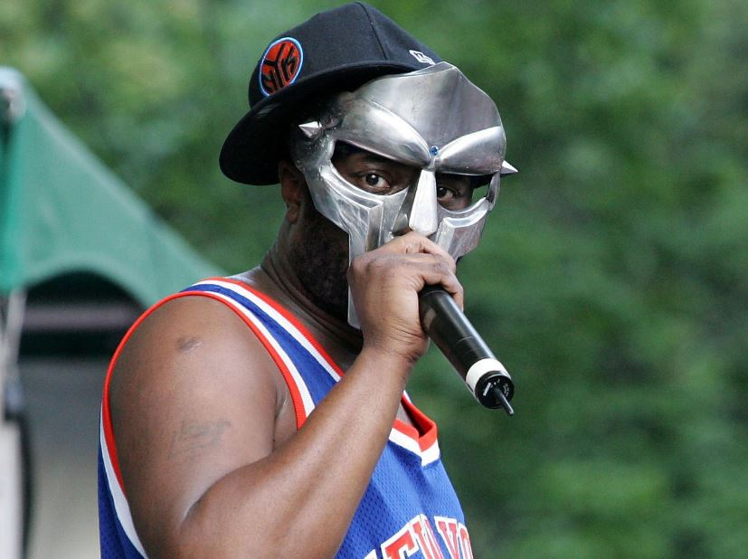

What can I say about this year? Fuck it for [stopping my live concert attendance March 10](https://fak3r.com/music-concerts/), but look, bands still put out amazing music! Some with the pandemic as a driver, and others without. Regardless, I think this was an excellent year for music after I openly wondered if not having the live component would kill it (it did not).

[Spotify playlist](https://open.spotify.com/playlist/6okZT5StwwI5gWMStf0gQo?si=ifMUPzi3Thun0fyrirNrMw)

## The top 12

I dislike ranking my favorite music of they year since there are so many different aspects that appeal to me, it just doesn't seem fair. Regardless I have to have a 'tops' list, and here it is, listed alphabetically.

* American Aquarium "Lamentations"
* Phoebe Bridges "Punisher"
* Nick Cave & The Bad Seeds "Idiot Prayer - Nick Cave Alone at Alexandra Palace"
* IDLES "Ultra Mono"
* Jónsi "Shiver"
* Kevin Morby "Sundowner"
* The Lawrence Arms "Skeleton Coast"
* Jeff Rosenstock "NO DREAM"
* Shifting "It Was Good"
* Tame Impala "The Slow Rush"
* Tycho "Simulcast"
* Waxahatchee "Saint Cloud"

## Favorites of the year

The following are favorites of mine from the year, I spent a good deal of time with most of these and consider them ones that could be in the Tops list, if there were ones missing in the current Tops list if that makes sense. Bah, this is all make believe, who cares if it makes sense. Again, checkout the links or anything you might dig, plenty to enjoy here

* Sonic Boom "All Things Being Equal"
* USA Nails "Character Stop"
* Fontaines DC "A Hero's Death"
* Margo Price "That's How Rumors Get Started"
* Jason Isbell "Reunions"
* The Mountain Goats "Songs for Pierre Chuvin"
* Run The Jewels "RTJ4"
* Single Mothers "Through a Wall (Deluxe)"
* Sleaford Mods "All That Glue" 
* Sorry "925"
* The Strokes "The New Abnormal"
* Lucinda Williams "Good Souls Better Angels"
* Craig Finn "All These Perfect Crosses"
* Fiona Apple "Fetch the Bolt Cutters"
* Fleet Foxes "Shore"
* Four Tet "Sixteen Oceans"
* Sylvan Esso "Free Love"
* Live Skull "Dangerous Visions"
* Sigur Rós, Steindór Andersen, Hilmar Örn Hilmarsson and María Huld Markan Sigfúsdóttir "Odin's Raven Magic"
* Matt Berninger "Serpentine Prison"
* Autechre "SIGN"

## Noteables

Some great releass from some old favorites, some I might just need more time with, but plenty of great things to discover here too.

* Lydia Loveless "Daughter"
* Bambara "Stray"
* Boris/Merzbo "2R012P0"
* Boris "NO"
* Bad Nerves "Bad Nerves"
* STRFKR "Ambient 1"
* The War On Drugs "Live Drugs"
* Gord Downie "Away Is Mine"
* Empty Horses "Tobin Sprout"
* Tycho "Weather Remixes"
* Thee Oh Sees "Levitation Sessions (live)"
* Víkingur Ólafsson "Debussy - Rameau"
* Metz "Atlas Vending"
* Refused "The Malignant Fire EP"
* Autechre "PLUS"
* Jeff Tweedy "Love Is The King"
* The Bobby Lees "Skin Suit"
* The Lemon Twigs "Songs For The General Public"
* Sylvan Esso "WITH"
* Gorillaz "Song Machine Season One"
* Menswear "Raritites: 1994-1998"
* Samantha Crain "A Small Death"
* The Long Now "The Luxembourg Signal"

## The parting shot

Well it was terrible year for [losing musicians](https://www.npr.org/2020/12/31/950086106/in-memoriam-2020-the-musicians-we-lost), too many to list, but these two really hit personally.

* Justin Townes Earle - you'll really be missed. Sad I only saw you 3 times, and that was on your last tour. An amazing songwriter and voice, no one like him. If you haven't heard him, might as well start with the lead off track from his last album, [The Saint Of Lost Causes](https://www.youtube.com/watch?v=F9pXYG1ZITk)

* MF DOOM - as if 2020 wasn't enough of a downer, we learned of this on the last day of the year. He was the top of his genre, the comment "your MC's favorite MC" says it all. Hard to pick something to start with here if you haven't heard him, so I'll just go with my favorite, [THAT'S THAT](https://www.youtube.com/watch?v=djOhV-55qTk)

