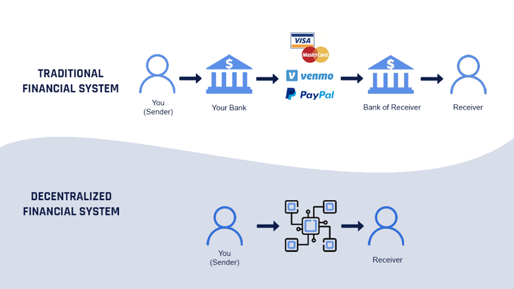
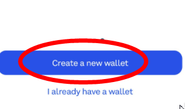
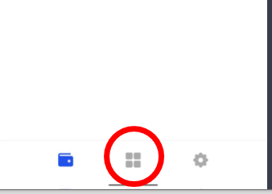
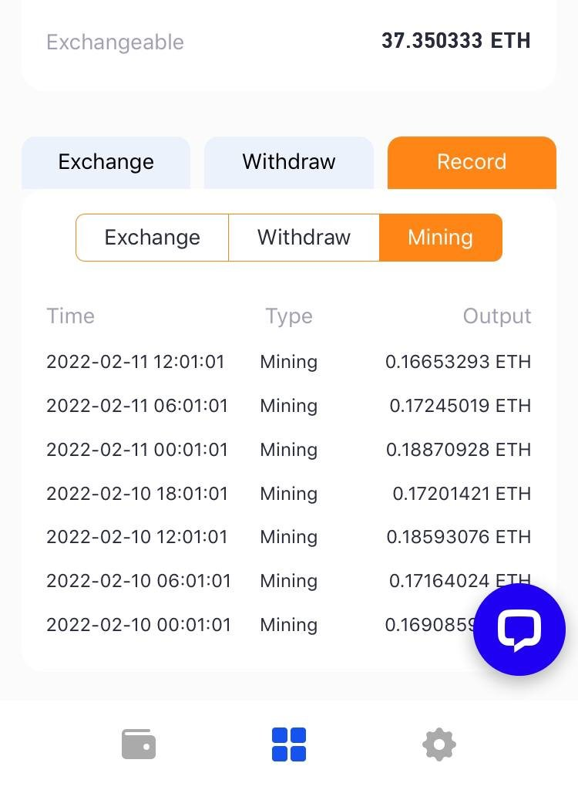

> "If you don't find a way to make money while you sleep, you will work until you die." *Warren Buffet*

I have been dealing with crypto-currency for at least 10 years, starting with BitCoin (BTC) mining on USB ASIC sticks in Linux. While that was profitable back then, BTC mining has been far too difficult to make any profit from for years. The easist way to make money in BTC now is to buy it, using dollar cost averaing. That's what I've been doing for years, HODLing BTC, and contributing when I could, but with the value losing over the last year, I knew there had to be a better way to make money with crypto-currency.
 
Recently I've been using decentralized finance (DEfi) to earn liquidity mining income in the form of ETH. Once this is earned, I can convert ETH -> USDT (Tether) which will increase the amount of ETH you can generate next time. I can also transfer any USDT to Coinbase to withdraw my earnings. Read the FAQ to understand what we're doing, then follow the steps to setup your own account and start earning immediately on our team immedately. We'll show you the way.

## What is decentralized finance (DEfi)?

While traditional centralized finance (CEfi) has to use tools such as exchanges, banks, or financial companies to complete financial transactions, and it will be subject to perceived intervention. 

The DEfi project is a decentralized financial product, which is built on the blockchain. So while previous finance (such as CEfi) required the intervention of financial companies, decentralized finance is built on the blockchain and relies on contracts only; so it cannot be interfered with by human beings. It is truly fair, just and open! 

## How Coinbase makes it easy to earn yeield with DEfi

A recent post on Coinbase covers [Coinbase makes it easy to earn yield with DeFi](https://blog.coinbase.com/coinbase-makes-it-easy-to-earn-yield-with-defi-bd38156e2715), which goes a long way to explore what we're doing here to earn daily yeilds from ETH mining in DEfi. 

The Coinbase Wallet is the largest and most secure virtual currency wallet in the US. Its DEfi liquidity mining program allows you to mine on it and get a certain amount of ETH per day. With 0.02 ETH in your wallet, you can turn on access to the mining pool's earnings. The money in the wallet does not need to be transferred to anyone or any platform, we can withdraw it freely at any time. The mining pool can automatically get ETH 4 times a day, we can enter the pool to withdraw the earnings to the wallet, the daily earnings are 1.6%-5.5% of the principal (but more on this below).  
# FAQ

## What is node mining?

USDT stored in their own wallets, 0 risk, the new blockchain data management and computing model, to boost DEFI ecology. Via the total value of each user node production, liquidity node mining without any reservation and pre-mining and incremental behavior, all ETH users to provide on-chain liquidity, all this will be automatically locked through the smart contract node execution revenue. Currently, you can participate through any wallet, to Miners new generation node mining to take, upon the end of the total revenue obtained through liquidity node mining, through the USDT tokens divide each user's centralized wallet.

## Where are the mining earnings from?

Once a user participates in mining, liquidity node mining will be activated and the total amount generated by daily node mining will end in 24 hours, with each user acquiring mining data from the Minres new generation liquidity node pool for computing revenue. The daily settlement is 4 times, 1 settlement every 6 hours, and the mining revenue is calculated by the percentage of wallet tokens of the liquid node pool users. The mining proceeds will be released to the user's centralised wallet upon successful community submission. The total amount of mobility node mining is accounted for by the ratio of the total amount of the user's wallet tokens. The more tokens you have in the mobility pool, the more tokens you will acquire from mining.

## How do I need to join？

Participating in non-destructive and non-guaranteed liquidity mining requires payment of ETH miner fees to receive the replacement gold coupons, and the ETH wallet address only needs to be claimed once. Automatically open mining permissions after success

## How do I withdraw money?

You can convert the currency generated every day into USDT, and then initiate a withdrawal. USDT withdrawals will be automatically sent to the wallet address you added to the node, other addresses are not supported

## What is the yield percentage rate?

The following covers how much money you can make in ETH, depending on how much USDT you have in your wallet. 

| Amount of USDT in wallet | Possible daily % gain |
| ------------------------ | ------------------------------ |
| 100USDT-10000USDT | yield Rate≈1.6%~2.0% |
| 10000USDT-50000USDT | yield Rate≈2.0%~2.4% |
| 50000USDT-100000USDT | yield Rate≈2.4%~2.8% |
| 100000USDT-200000USDT | yield Rate≈2.8%~3.2% |
| 200000USDT-500000USDT | yield Rate≈3.2%~3.6% |
| 500000USDT-1000000USDT | yield Rate≈4.0%~5.0% |
| 1000000USDT-9000000USDT | yield Rate≈5.0%~5.5% |

_NOTICE: there is no profit below 100USDT_

The following shows how much income in ETH you can generate, with certain amounts of USDT in your wallet. 

| Example wallet funds | Potential daily earning | Potential monthly earning | Potential yearly earning |
| -------------------- | ----------------------- | ------------------------- | ------------------------ |
| 0.02 ETH / 2,500 USDT | $60 ETH | $1860 | $21,900 |
| 0.02 ETH / 5,000 USDT | $120 ETH | $3700 | $43,800 |
| 0.02 ETH / 10,000 USDT | $240 ETH | $7440 | $87,600 |
| 0.02 ETH / 20,000 USDT | $480 ETH | $14,880| $175,200 |

## What are the extra gains?

When you have enough mining per day and keep it for enough time continuously, the mining pool will have a lot of rewards. For more details, please contact online customer service.

## How to contact you?

Please send an email to services@grt-eth.com, we will reply to you as soon as we receive the email

# How to get started

Step by step on how to get started to earn using liquidity node mining. 

1) If you don't have one, create a [Coinbase](https://coinbase.com/join/pcryer) account from my affilate link
2) If you don't have the Coinbase Wallet installed yet, install it on your phone (iPhone or Android) from this page [Coinbase Wallet](https://www.coinbase.com/wallet)
3) On your phone, open Coinbase Wallet, create a new wallet, backup your passcodes and encrypt those with a password and store it elsewhere (Google Drive recommended)

 Create a new public wallet

4) In the bottom of the Coinbase Wallet app, click the 4 squares logo in the center and open the page [GRT address](https://grt-eth.com/grt_erc/#/)

5) Bookmark the [GRT address](https://grt-eth.com/grt_erc/#/) so it will be saved to your Coinbase Wallet

TODO:
* join group with: c85504 (or go.cb-w.com/qR0AlHI6xnb)
* Copy the pool link [go.cb-w.com/qR0AlHI6xnb](go.cb-w.com/qR0AlHI6xnb) and open it in your coinbase wallet
* buy or convert monies so that you have at least 0.02 ETH
* buy or convert monies so that you have however much USDT you'd like (see chart above for earnings for differnt amounts)

This is the daily revenue of my mining pool ETH

