(cover)Cheap Girls (photo courtesy of <a href="http://www.cheapgirls.net/">Cheap Girls</a>)

## The year

It's been a great year (musically), and I've kept my head above water by going out to see some great shows. Highlights include; Basia Bulat, Jason Isbell, Shovels & Rope, Neon Indian, Guided by Voices, The Thermals, Summer Canibals, Screaming Females, Aye Nako, The Waco Brothers, Cheap Girls, Bob Mould Band, Lydia Loveless, Will Courtney & the Wild Bunch, Built To Spill, The Posies, Shellac, Shannon Wright, Amanda Shires, Colter Wall, and Sloan. Looking for trends I can say there were more new bands that I saw versus known bands, so I'm still finding new stuff which is all part of the fun.

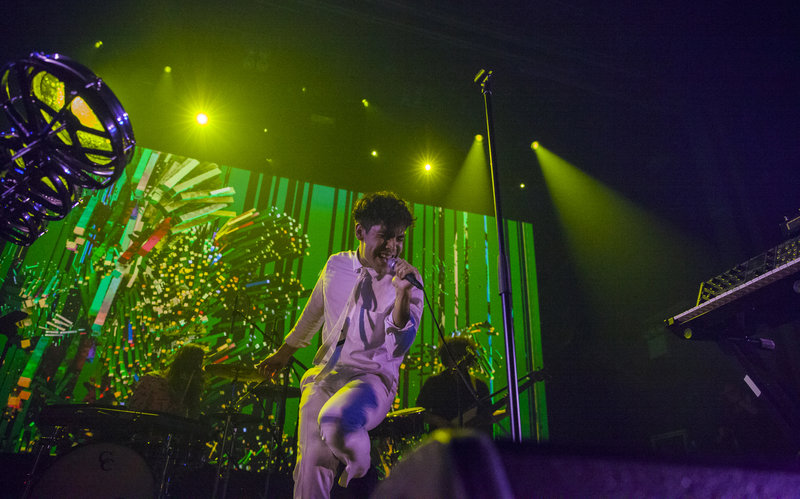

  Neon Indian (photo courtesy of{' '}
  <a href="http://volvoxlabs.com/neon-indian-live-performance/">Volvoxlabs</a>)

## The list

- Basia Bulat "Good Advice"
- Car Seat Headresst "Teens of Denial"
- Nick Cave and the Bad Seeds "Skeleton Tree"
- Cheap Girls "God's Ex-Wife"
- Deep Sea Diver "Secrets"
- DJ Shadow "The Mountain Will Fall"
- Explosions In The Sky "The Wilderness"
- Greys "Outer Heaven"
- Huerco S. "For Those Of You Who Have Never (And Also Those Who Have)"
- The Julie Ruin "Hit Reset"
- Lydia Loveless "Real"
- Mogwai "Atomic"
- Radiohead "Moon Shaped Pool"
- Amanda Shires "My Piece Of Land"
- Elliott Smith "Heaven Adores You"

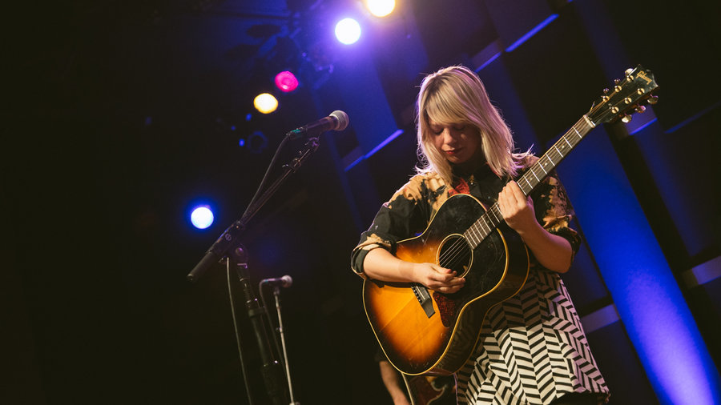

  Basia Bulat (photo courtesy of{' '}
  <a href="http://www.npr.org/sections/world-cafe/2016/02/03/465436824/basia-bulat-on-world-cafe">
    NPR
  </a>
  )

## The covers

&nbsp;
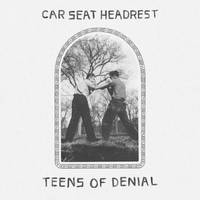
&nbsp;
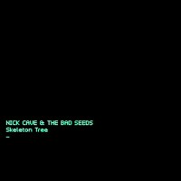
&nbsp;

&nbsp;

&nbsp;
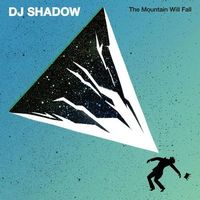
&nbsp;
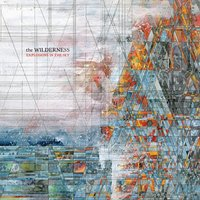
&nbsp;
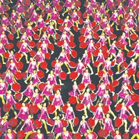
&nbsp;
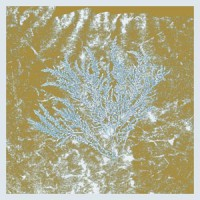
&nbsp;
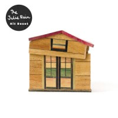
&nbsp;

&nbsp;
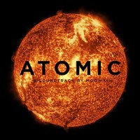
&nbsp;
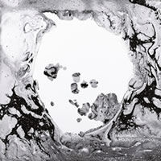
&nbsp;

&nbsp;
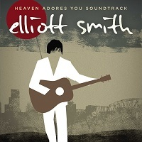

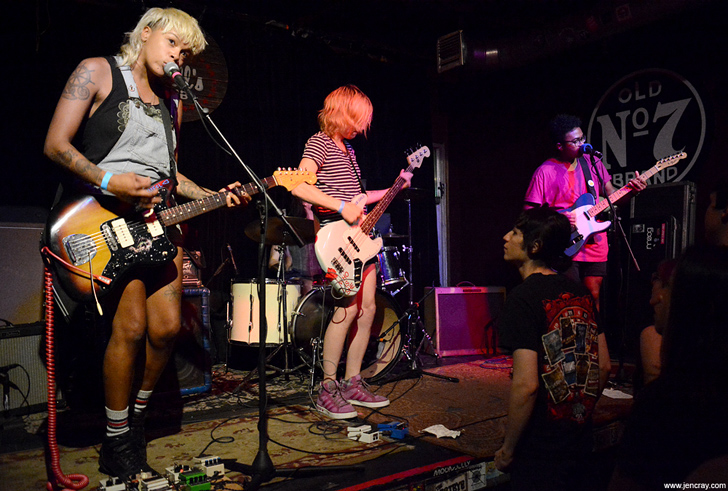

  Aye Nako (photo courtesy of <a href="http://www.jencray.com/">Jen Cray</a>)

## The honorable mentions

- Anohni "Hopelessness"
- Band Of Horses "Why Are You OK"
- The Field "The Follower"
- Future of the Left "The Peace & Truce of Future of the Left"
- Hiss Golden Messenger "Heart Like a Levee"
- Isolation Berlin "Und Aus Den Wolken Tropft Die Zeit"
- The Jayhawks "Paging Mr. Proust"
- Minor Victories "Minor Victories"
- Bob Mould "Patch The Sky"
- Okkervil River "Away"
- Parquet Courts "Human Performance"
- The Radio Dept. "Running Out of Love"
- Shovels & Rope "Little Seeds"
- Teenage Fanclub "Here"
- The Tragically Hip "Man Machine Poem"
- The Wedding Present "Going, Going..."

## Parting shot

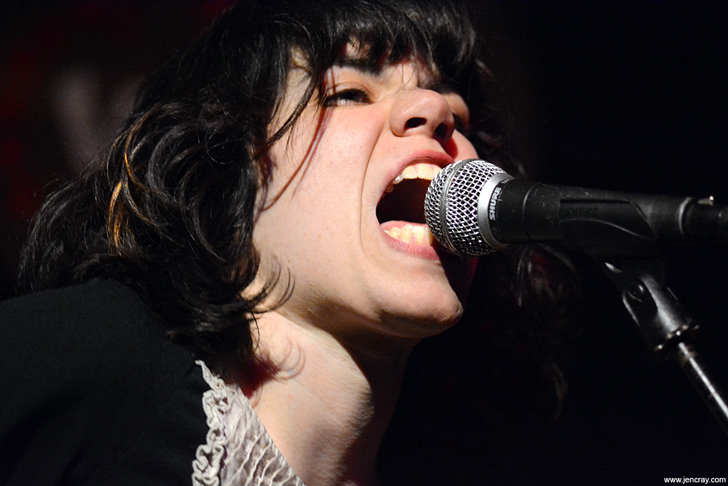

  Screaming Females (photo courtesy of{' '}
  <a href="http://www.jencray.com/">Jen Cray</a>)

