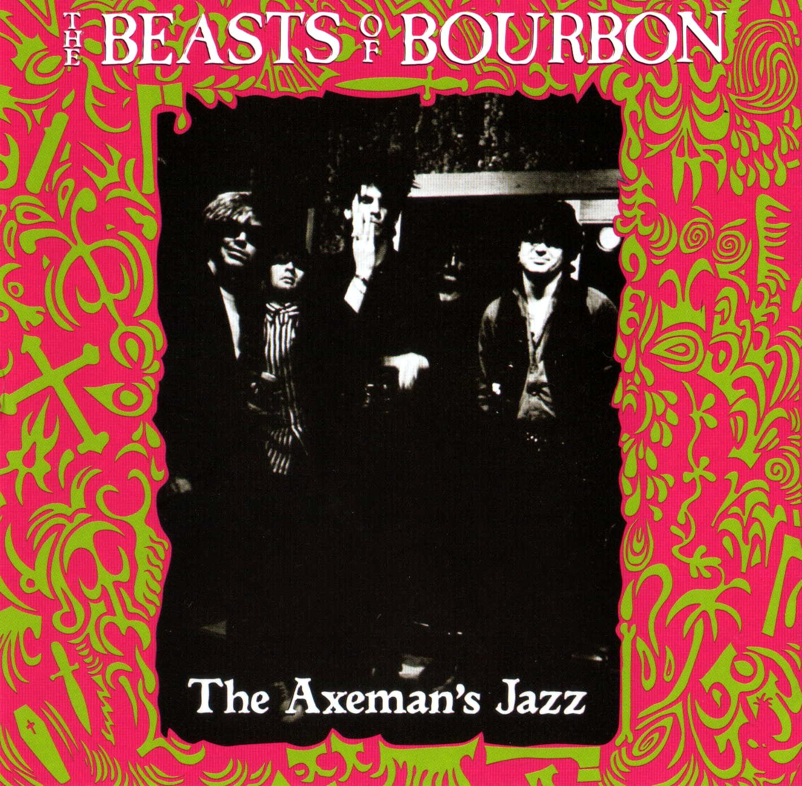
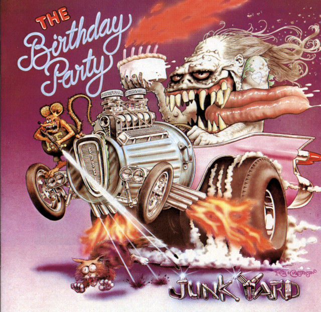
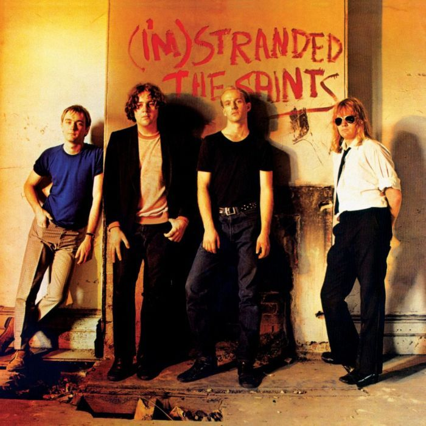

For as long as I can remember I've been infatuated with Australia, and one thing I've always admired about the country is its unique sense of place; things from Australia are born of the land down under. Growing up in the 70s I was a big [AC/DC](https://en.wikipedia.org/wiki/AC/DC) fan, having all of their cassettes, even some imports ([TNT](<https://en.wikipedia.org/wiki/T.N.T._(album)>)), along with a few records of the later, post-Bon Scott era. Of course as I grew up and got into better music, I started hearing Aussie bands and always loved their sound. Bands like INXS, Hoodoo Gurus, Models, The Church, got airplay on MTV and became favorites, later Midnight Oil, Hunters & Collectors, and the Go Betweens showed even more variety. Meanwhile I was always interested in the differences, bands from AU were certainly influenced by what was happening in other countries, but they were still a product of their surroundings. While punk sounded different if you were in the UK (Sex Pistols, The Clash, Buzzcocks), the US-east (Ramones, Talking Heads, Bad Brains), or the US-west (X, Black Flag, Suicidal Tendancies), once you started looking at the AU punk bands; they really sounded different.

## The reveal

So finally, I present to you the 3 Best Australian Punk Albums:

&nbsp;&nbsp;&nbsp;
&nbsp;&nbsp;&nbsp;

## The writeups

### The Beasts of Bourbon "Axeman's Jazz (1984)

### The Birthday Party "Junkyard" (1982)

### The Saints "(I'm) Stranded" (1977)

