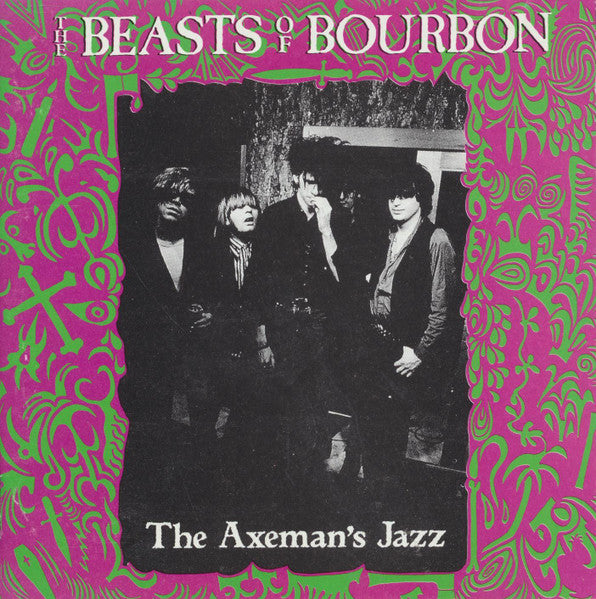
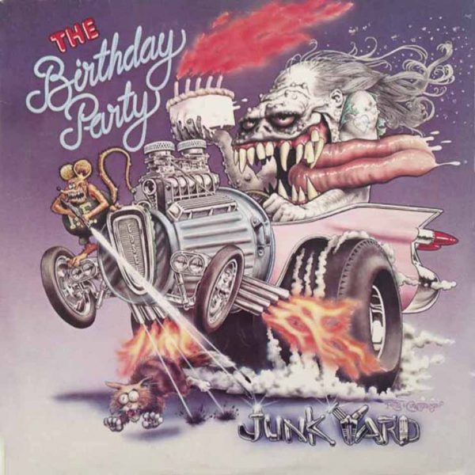
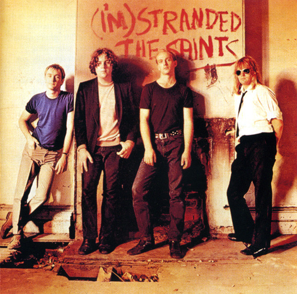

For as long as I can remember I've been infatuated with Australia, and one thing I've always admired about the country is its unique sense of place; things from Australia are born of the land down under. Growing up in the 70s I was a big [AC/DC](https://en.wikipedia.org/wiki/AC/DC) fan, having all of their cassettes, even some imports ([TNT](<https://en.wikipedia.org/wiki/T.N.T._(album)>)), along with a few records of the later, post-Bon Scott era. Of course as I grew up and got into better music, I started hearing Aussie bands and always loved their sound. Bands like INXS, Hoodoo Gurus, Models, The Church, got airplay on MTV and became favorites, later Midnight Oil, Hunters & Collectors, and the Go Betweens showed even more variety. Meanwhile I was always interested in the differences, bands from AU were certainly influenced by what was happening in other countries, but they were still a product of their surroundings. While punk sounded different if you were in the UK (Sex Pistols, The Clash, Buzzcocks), the US-east (Ramones, Talking Heads, Bad Brains), or the US-west (X, Black Flag, Suicidal Tendancies), once you started looking at the AU punk bands; they really sounded different.

## The reveal

So finally, I present to you the 3 Best Australian Punk Albums:

### The Beasts of Bourbon 

[The Axeman's Jazz](https://en.wikipedia.org/wiki/The_Axeman%27s_Jazz) (1984) - "The Axeman's Jazz is the debut album by Australian blues rock band Beasts of Bourbon which was recorded in October 1983 and originally released in 1984 on the Green/Big Time label."

### The Birthday Party 

[Junkyard](https://en.wikipedia.org/wiki/Junkyard_(album)) (1982) - "Junkyard is the second and final studio album by Australian post-punk group the Birthday Party. It was released on 10 July 1982 through the label 4AD in the UK and through Missing Link Records in Australia. It was the group's last full-length studio recording. It has received critical acclaim."

### The Saints 

[(I'm) Stranded](https://en.wikipedia.org/wiki/(I%27m)_Stranded) (1977) - "(I'm) Stranded is the debut album by Australian punk rock group The Saints which was released by EMI on 21 February 1977. Their debut single, "(I'm) Stranded", was issued ahead of the album in September 1976, which Sounds magazine's reviewer, Jonh Ingham, declared was the "Single of this and every week". "Erotic Neurotic" was the second single, which was released in May 1977 and the group relocated to the United Kingdom."

