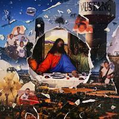
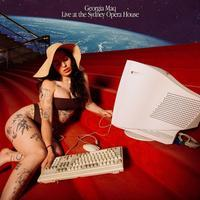
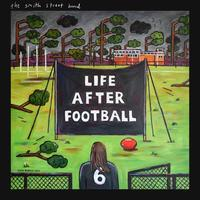
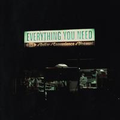
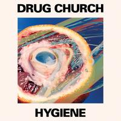
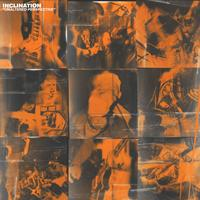
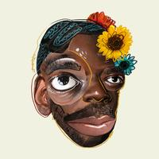

    

My annual best music of the year list that I always spend too much time compiling. Hope you agree on some, and/or find some new things to discover. Black Country, New Road, Cola, Kevin Devine, Fresh, Just Mustard, and Jeff Parker were my favorite new discoveries this year.

## The list

- Bartees Strange "Farm To Table
- Black Country, New Road "Ants From Up There"
- Built to Spill "When The Wind Forgets Your Name"
- Camp Cope "Running With the Hurricane"
- The Chats "Get Fucked"
- Cola "Deep In View"
- Danger Mouse, Black Thought "Cheat Codes"
- Kevin Devine "Nothing's Real, So Nothing's Wrong"
- Dry Cleaning "Stumpwork"
- Craig Finn "A Legacy Of Rentals"
- Fontaines D.C. "Skinty Fia"

- Fresh "Raise Hell"
- Julia Jacklin "Pre Pleasure"
- Kevin Morby "This Is A Photograph"
- Just Mustard "Heart Under"
- Georgia Maq "Live at Sydney Opera House EP"
- MJ Lenderman "Boat Songs" \*
- Martha "Please Don't Take Me Back"
- OFF! "Free LSD"
- Jeff Parker "Mondays at The Enfield Tennis Acadamy"
- Single Mothers "Everything You Need"
- The Smith Street Band "Life After Football"
- Spiritualized "Everything Was Beautiful"
- Yard Act "The Overload"

## Honerable mentions

- Beach Bunny "Emotional Creature"
- Black Star "No Fear of Time"
- Cate Le Bon "Pompeii"
- Dehd "Blue Skies"
- Drug Church "Hygiene"
- Horsegirl "Versions of Modern Performance"
- Inclination "Unaltered Perspective"
- Kiwi Jr. "CHOPPER"
- NNAMDÏ "Please Have a Seat"
- Wet Leg "Wet Leg"
- Yeah Yeah Yeahs "Cool It Down"
