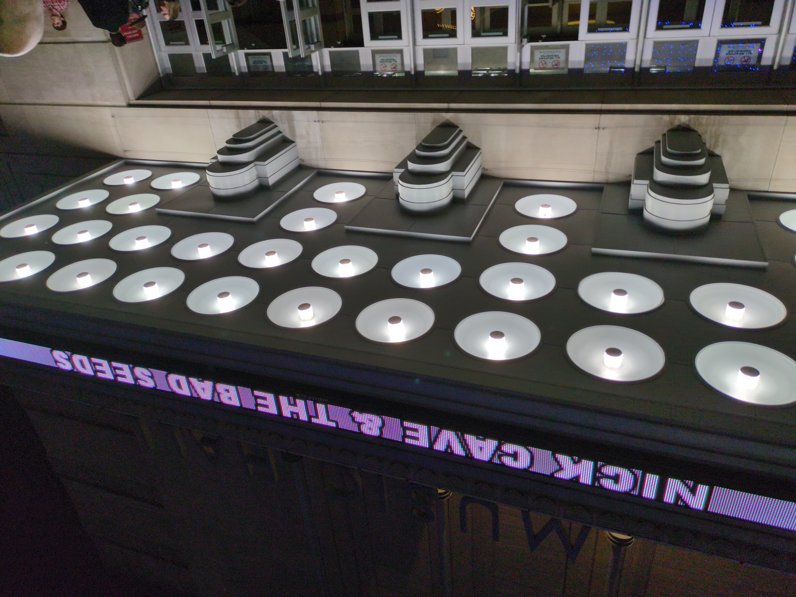

Monday night, Nick Cave and the Bad Seeds brought their tour from their latest effort "Wild God" to Kansas City, and played a thrilling set from start to finish. While ensuring old timers like me (fan since the mid-late 80s) were happy Nick played old fan favorites like "Tupelo", "From Her to Eternity", he surprised us with a raucous "Papa Won't Leave You Henry", with its awesome chorus filling the hall, and chorus all in on as if to add emphasis to the story.

 

## The band

While "The Weeping Song" will never sound like it did with Blixa's slighly terrifying baritone leading the pack, this band did it justice, hitting the high notes that (in my mind) seem to be their specitality. They bring the drama to Nick's stories more than I recall happening in the past. Regadless, Nick's comment before the song that "We won't be weeping long" seemed to be veiled statement about our current political environment, which I hope was also nodded to when he complimented our "lovely country". While not usually one to get political it's pretty easy to understand where he stands, and I share his hope about the length of our time weeping.

### Colin

A very nice addition to this itteration of the band is Colin Greenwood, bass player for [Radiohead](https://www.radiohead.com/) who brings a solid presense. I previously saw him playing with Nick last year on the Solo tour; it was just Nick on piano/vocals, and Colin on bass. On joining the larger band, [Colin explained](https://www.mojo4music.com/articles/stories/colin-greenwood-nick-cave/):

> “Nick and Warren were working on the album in London and they called me to pop in. They were thinking about how to make it more open-ended – less hermetic, perhaps. I sat there with my bass and listened to them and tried not to get in the way. If I heard something I liked, I tried to respond to it. I literally lived down the road. And I make good tea.

### Warren

Any talk of a Bad Seeds show has to focus on Warren, whose imapact on the Seeds the past 20 years has been amazing, from seemingly a side-man violinist to the crux of the current Seeds sound. At one point, during "Joy", I caught Colin locked in on Warren, as he directed his bass timing with his right foot, slightly raised into the air as he slouched in a chair, which he did for the majority of the set. Hardly a side player, this wizard looking madman used to front the Australian band The Dirty Three, who I used to see in the punk rock clubs of Austin. Warren was then quite young, weren't we all, beardless and usually sporting an AC/DC tshirt over a dress jacket while he screamed while ripping notes from his violin. An instrumental band unlike any I'd ever seen, but when he became a Bad Seed, something happened. As I've bemoaned the [departure of Mick Harvey](https://fak3r.com/2009/01/25/mick-harvey-quits-the-bad-seeds/), I think his time with Nick, starting in the late 1970s mind you, had run out, or perhaps he was tired of touring... regardless, a original Bad Seed that proved his meddle for 25 years was done, and Warren more than made up for the gap.

### Nick

It's hard (for me) to understand how Nick became such a dynamic storyteller, but it's been a trip to see old videos from the very early 80s of him screamning his head off, to a more nuanced piano based introspection, to well "Let Love In" to "Murder Ballads" and finallys seeming get to that next chapter with "Dig Lazurus! Dig!". The terrible dual tragities of him losing two of his sons just years apart is heartbreaking, but he's channeled that grief into introspection and really a celebration of life. He's also really opened up with his most recent book, the proceeding interview tour, and the glorious [The Red Hand Files](https://www.theredhandfiles.com/), his own mailing list where he directly responds to fans letters. While not the most original idea his humanity is on full display and I really enjoy following his narratives and stories that make up his replies. After such a long, crazy set, I was amazed that he was still up hours later writting a new entry [consoling a fan after the sudden loss of their father](https://www.theredhandfiles.com/sudden-death-apologise-spiritual-intuition/). He's clearly doing what he was put here to do, and I'd argue he's at the top of his game.

## Setlist

Here's the setlist from the crowd-sourced (pun intended) website aptly named [Setlist.fm](https://www.setlist.fm/setlist/nick-cave-and-the-bad-seeds/2025/music-hall-kansas-city-mo-33526cbd.html)

> Nick Cave & the Bad Seeds  
> The Wild God Tour - North America 2025 Tour  
> Music Hall, Kansas City, MO, USA  
> May 5 2025

### Main set

1. Frogs
1. Wild God
1. Song of the Lake
1. O Children
1. Jubilee Street
1. From Her to Eternity
1. Long Dark Night
1. Cinnamon Horses
1. Tupelo
1. Conversion
1. Bright Horses
1. Joy
1. I Need You
1. Carnage
1. Final Rescue Attempt
1. Red Right Hand
1. The Mercy Seat
1. White Elephant

### Encore

1. Papa Won't Leave You, Henry
1. The Weeping Song
1. Skeleton Tree
1. Into My Arms (solo, on piano)

## Closure

I was reminded by an Albert Camus quote, that I previously shared here earlier this year, where he seemingly quotes some of my thoughts of Nick as a long tortured, or at least well-weathered, artist...

> In order to be created, a work of art must first make use of the dark forces of the soul

