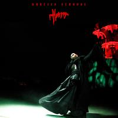
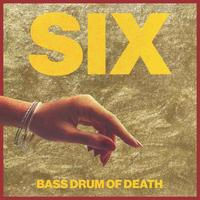
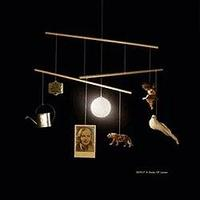
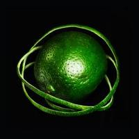

> NOTE: this is a preview of my annual 'best music of' posts, more details, opinons, photos, etc will be shared soon, I just need(ed) to get this posted before 2026 hits.

## The list

* Bartees Strange "Horror"

* Bass Drum of Death "Six"

* Beirut "A Study of Losses"

* Big Thief "Double Infinity"

* The Chills "Spring Board: The Early Unrecorded Songs"
* Deafheaven "Lonely People With Power"
* Craig Finn "Always Been"
* Hotline TNT "Raspberry Moon"
* Mogwai "The Bad Fire"
* Osees "ABOMINATION REVEALED AT LAST"
* Jonathan Richman "Only Frozen Sky Anyway flac"
* The Smith Street Band "Once I Was Wild"
* Sombr "I Barely Know Her"
* SPRINTS "All That Is Over"
* Stereolab "Instant Holograms On Metal Film"
* Laura Steveson "Late Great"jj
* Suede "Antidepressants"
* SUNN O))) "Eternity's Pillars b/w Raise the Chalice & Reverential"
* Swans "Birthing"

 in Saint Louis, MO](tm.png)
<small>Teen Mortgage at [Sinkhole](https://sinkholerecords.com/) in Saint Louis, MO</small>

* Teen Mortgage "Devil Ultrasonic Dream"

 in Kansas City, MO](tbr.png)
<small>Teenage Bottlerocket at [RecordBar](https://www.therecordbar.com/) in Kansas City, MO</small>

* Teenage Bottlerocket "Ready To Roll"
* Turnstile "NEVER ENOUGH"
* Viagra Boys "viagr aboys"

## Honorable mentions

These are my honoralbe mentions, none of these are bad at all, and some have gotten major attention this year but they just didn't click with **me** over the year. I have them here and give the same disclaimer I always do, these are albums I'll revisit as time goes on and revisit. Who knows, maybe one or more of them will "move up"! Stay tuned, how exciting!

* Bonnie 'Prince' Billy "The Purple Bird"
* Black Country, New Road "Forever Howlong"
* Geese "Getting Killed"
* Lambrini Girls "Who Let the Dogs Out"
* Militarie Gun "God Save the Gun"
