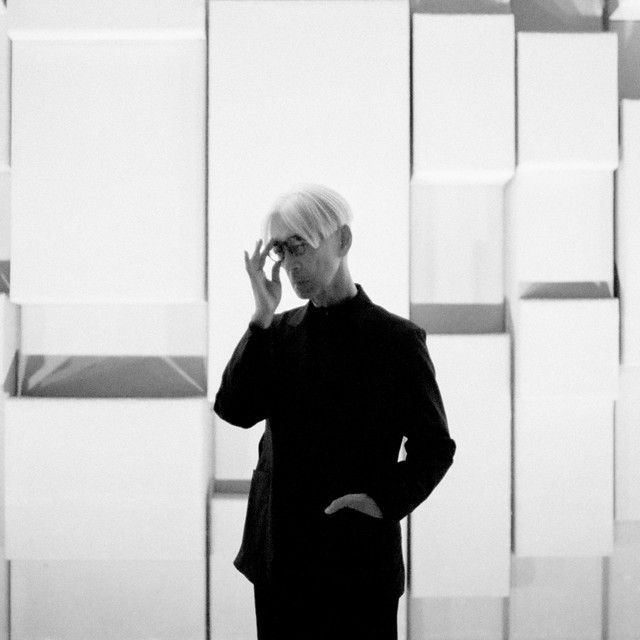

One of Japanese music icon Ryuichi Sakamoto's sayings: "<b>Ars longa, vita brevis</b>" <i>(art is long, life is short)</i> 

<iframe title="vimeo-player" src="https://player.vimeo.com/video/415107317?h=0c5e398421" width="640" height="360" frameborder="0" referrerpolicy="strict-origin-when-cross-origin" allow="autoplay; fullscreen; picture-in-picture; clipboard-write; encrypted-media; web-share"   allowfullscreen></iframe>

> Ryuichi Sakamoto (Japanese: 坂本 龍一, Hepburn: Sakamoto Ryūichi; January 17, 1952 – March 28, 2023) was a Japanese musician, composer, keyboardist, record producer, singer and actor. He pursued a diverse range of styles as a solo artist and as a member of the synth-based band Yellow Magic Orchestra (YMO). With his YMO bandmates Haruomi Hosono and Yukihiro Takahashi, Sakamoto influenced and pioneered a number of electronic music genres. As a film score composer, Sakamoto won an Academy Award (Oscar), BAFTA, Grammy and two Golden Globe Awards. 
>
> Sakamoto began his career as a session musician, producer, and arranger while he was at the Tokyo National University of Fine Arts and Music in the mid 1970s. His first major success came in 1978 as co-founder of YMO. He pursued a solo career at the same time, releasing the experimental electronic fusion album Thousand Knives in that year, and the album B-2 Unit in 1980. B-2 Unit includes the track "Riot in Lagos", which had a significant influence on the development of electro, hip hop and dance music. He went on to produce more solo records, and collaborate with many international artists, including David Sylvian, DJ Spooky, Carsten Nicolai, Youssou N'Dour, and Fennesz. Sakamoto composed music for the opening ceremony of the 1992 Barcelona Summer Olympic Games, and his composition "Energy Flow" (1999) was the first instrumental number-one single in Japan's Oricon charts history.
>
> Merry Christmas, Mr. Lawrence (1983) marked his debut as both an actor and a film score composer; its main theme was adapted into the single "Forbidden Colours" which became an international hit. His most successful work as a film composer was The Last Emperor (1987), for which he won the Academy Award for Best Original Score, making him the first Japanese composer to win an Academy Award. He continued earning accolades composing for films such as The Sheltering Sky (1990), Little Buddha (1993), and The Revenant (2015). On occasion, Sakamoto also worked as a composer and a scenario writer on anime and video games. He was awarded the Ordre des Arts et des Lettres from the Ministry of Culture of France in 2009 for his contributions to music. Sakamoto died on March 28, 2023 from colorectal cancer at the age of 71. 
>
> Source: [wiki/Ryuichi_Sakamoto](https://en.wikipedia.org/wiki/Ryuichi_Sakamoto)

<small>Ryuichi Sakamoto (1952-2023)</small>

"<b>Ars longa, vita brevis</b>" <i>(art is long, life is short)</i> 

Words to live by, thank you Ryuichi, RIP.
