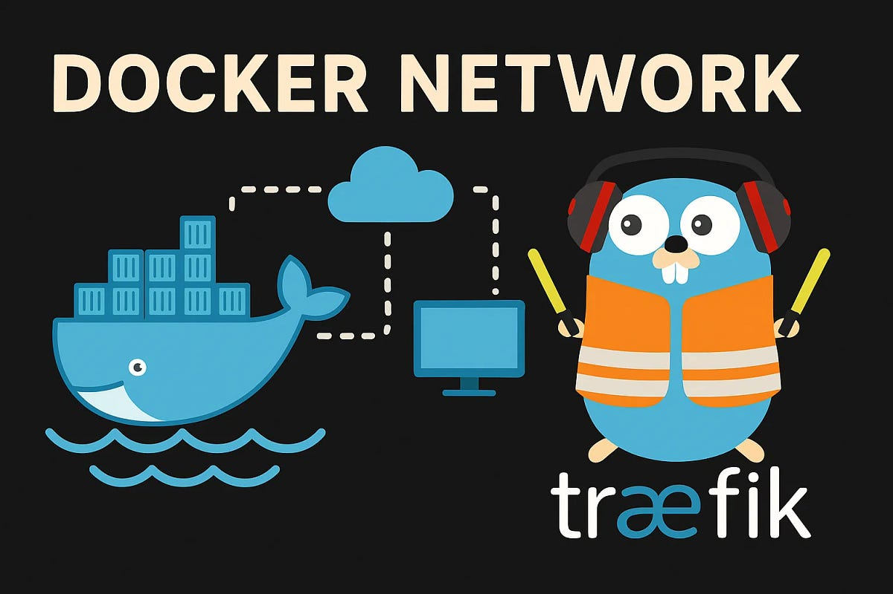

From my early days of learning how to run a website using the venerable [Apache HTTP Server](https://projects.apache.org/project.html?httpd-http_server), to understanding how to load its modules to allow CGI, PHP, and SSL functionaity, to delivering a [LAMP stack](https://en.wikipedia.org/wiki/LAMP_(software_bundle)) that we all used to constantly run for MySQL/PHP sites, web delivery has been a never-ending journey. Add in amazing tools like [HAProxy](https://www.haproxy.com/), and the modern caching champion [Varnish](https://www.varnish-software.com/), which made [Squid](https://www.squid-cache.org/) feel so 90s, and routing, parsing and devliery all fell in line with endless configuraion options. From there we go to my long (long!) standing love of the simplicity of [nginx](nginx.org), which I've [posted about many times here](https://fak3r.com/tags/nginx/), comes my new, favorite way to deliver static web content in 2026 and beyond; .

https://traefik.io/traefik

The Cloud Native
Application Proxy

rust based 

https://github.com/static-web-server


A cross-platform, high-performance and asynchronous web server for static files-serving. ⚡

## Why Traefik?

The Solution: A Unified Runtime Layer for All Workloads

A unified runtime layer sits above the execution environments but below the application logic. It standardizes how traffic flows, how identity is enforced, how APIs are exposed, how workloads are protected, and how intelligence is applied. Rather than replacing infrastructure, this approach brings coherence to it.


---


Traefik Proxy unifies ingress, routing, and traffic management across containers (Kubernetes, ECS, Swarm, Nomad, etc.), VMs, and hybrid architectures.
Traefik API Gateway brings consistent identity, policy enforcement, and visibility to every environment.
Traefik AI Gateway manages AI inference traffic as a first-class workload, handling guardrails, cost controls, and semantic caching.
Traefik MCP Gateway ensures agentic AI systems interact with enterprise infrastructure safely and predictably.
Traefik API Management provides comprehensive governance, from developer portals to GitOps-driven operations at s


## Why static-web-server?


 A cross-platform, high-performance & asynchronous web server for static files serving
Overview¶

Static Web Server (or SWS abbreviated) is a tiny and fast production-ready web server suitable to serve static web files or assets.

It is focused on lightness and easy-to-use principles while keeping high performance and safety powered by The Rust Programming Language.

Written on top of Hyper and Tokio runtime, it provides concurrent and asynchronous networking abilities and the latest HTTP/1 - HTTP/2 implementations.

Cross-platform and available for Linux, macOS, Windows, FreeBSD, NetBSD, Android, Docker and Wasm (via Wasmer).

## Getting started

To get started we only need to install [Docker Engine](https://docs.docker.com/engine/install/) and [Docker Compose](https://docs.docker.com/compose/) the other components will be delivered within Docker containers called out by the Docker `compose.yml` configuration file.

Once those two items are installed and working, let's take a look at the files we need, first to run Traefik in Docker:

```bash
❯ tree traefik/
traefik/
├── compose.yml
├── dynamic
│   ├── compress.yml
│   ├── dashboardheaders.yml
│   ├── localonly.yml
│   ├── musicassistant.yml
│   └── secureheaders.yml
├── etc
│   ├── dynamic.yml
│   └── traefik.yml
└── letsencrypt
```

First we'll look at Traefik's `compose.yml` to understand how it runs in Docker:

```yaml
---
networks:
  traefik:
    driver: bridge
    external: true
    attachable: true

services:
  traefik:
    image: traefik:v3
    restart: unless-stopped
    ports:
      - "80:80"
      - "443:443"
    volumes:
      - ./letsencrypt:/letsencrypt
      - ./dynamic:/etc/traefik/dynamic:ro
      - /var/run/docker.sock:/var/run/docker.sock:ro
    security_opt:
      - no-new-privileges:true
    command:
      - "--providers.docker=true"
      - "--providers.docker.exposedbydefault=false"

      - "--providers.file.directory=/etc/traefik/dynamic"
      - "--providers.file.watch=true"

      - "--entrypoints.web.address=:80"
      - "--entrypoints.web.http.redirections.entrypoint.to=websecure"
      - "--entrypoints.web.http.redirections.entrypoint.scheme=https"

      - "--entrypoints.websecure.address=:443"

      - "--certificatesresolvers.myresolver.acme.email=admin@lowf.at"
      - "--certificatesresolvers.myresolver.acme.storage=/letsencrypt/acme.json"
      - "--certificatesresolvers.myresolver.acme.tlschallenge=true"

      - "--entrypoints.websecure.http.middlewares=compress@file,secureheaders@file"

      - "--api.dashboard=false"

    networks:
      - traefik
```

First we define a `network:` stack called Traefik for our containers to communicate on, and discover each other. The only `service:` is our Traefik container listening on ports 80 and 443 as you'd expect.

Then we'll look at the static web content backend that Traefik will automatically route to:

```yaml
---
services:
  static-web-server:
    #image: joseluisq/static-web-server:2
    image: ghcr.io/static-web-server/static-web-server:2-alpine
    environment:
      # static-web-server config
      - SERVER_PORT=8080
      - SERVER_ROOT=/public
      - SERVER_LOG_LEVEL=info
    container_name: ${SITE_NAME}
    restart: unless-stopped
    volumes:
      - ./html:/public
    labels:
      - "traefik.enable=true"
      - "traefik.docker.network=proxy"
      - "traefik.http.routers.${SITE_NAME}.tls=true"
      - "traefik.http.routers.${SITE_NAME}.entrypoints=websecure"
      - "traefik.http.routers.${SITE_NAME}.rule=Host(`${SITE_FQDN}`)"
      - "traefik.http.routers.${SITE_NAME}.tls.certresolver=le"
      - "traefik.http.services.${SITE_NAME}.loadbalancer.server.port=${SITE_PORT}"
    networks:
      - proxy

networks:
  proxy:
    external: true
```

And the associated `.env` in the same directory to define the various variables we used in the yaml:

```bash
SITE_FQDN=silverbeet.tech
SITE_NAME=silverbeet
SITE_PORT=8080
```



