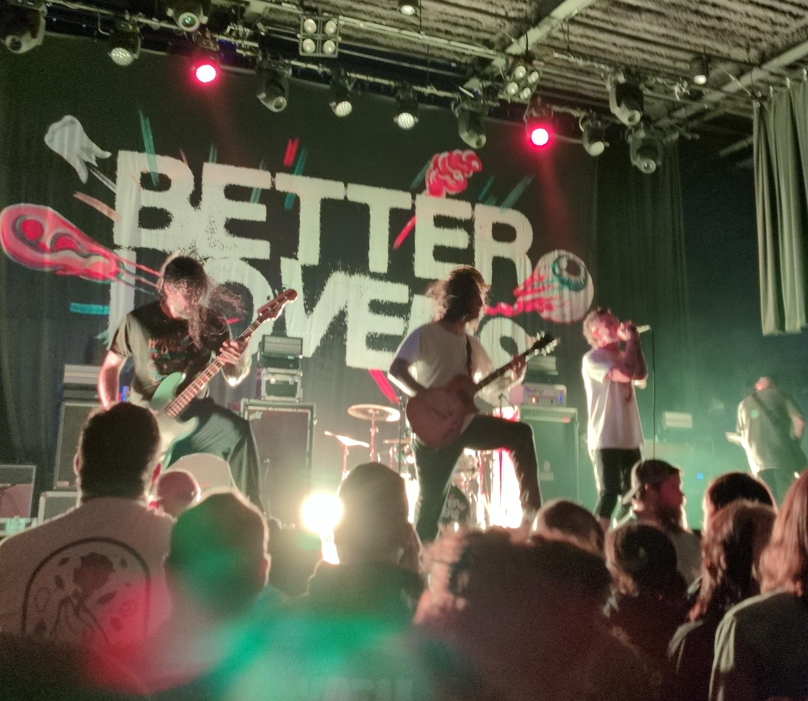
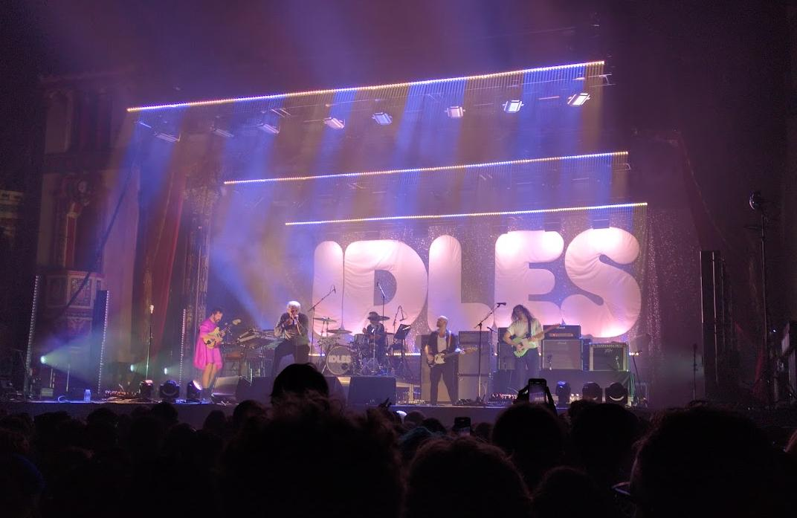
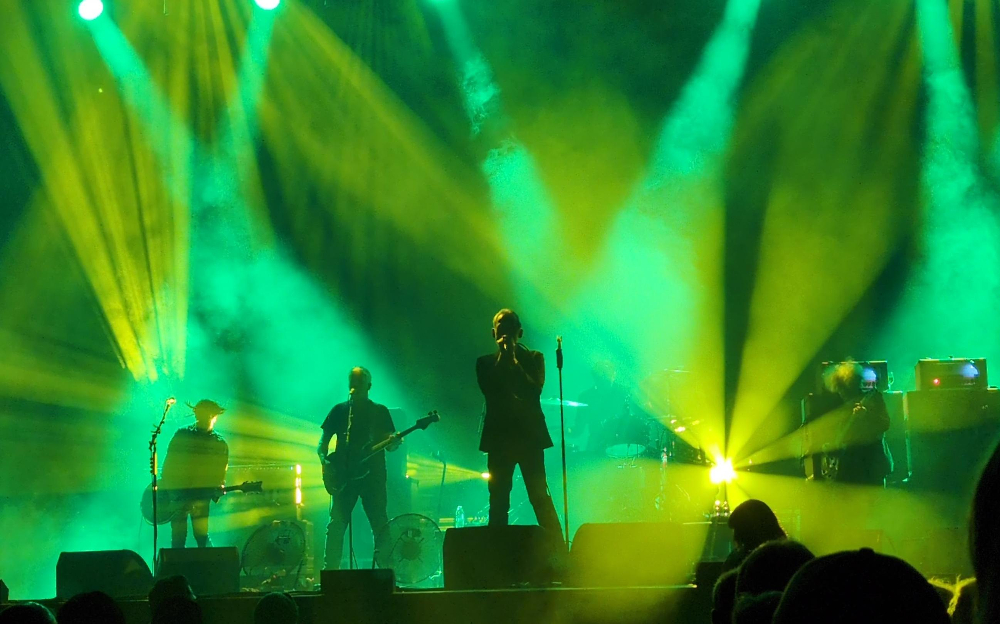
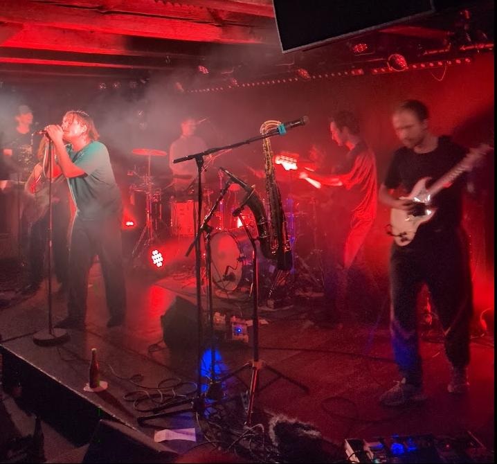
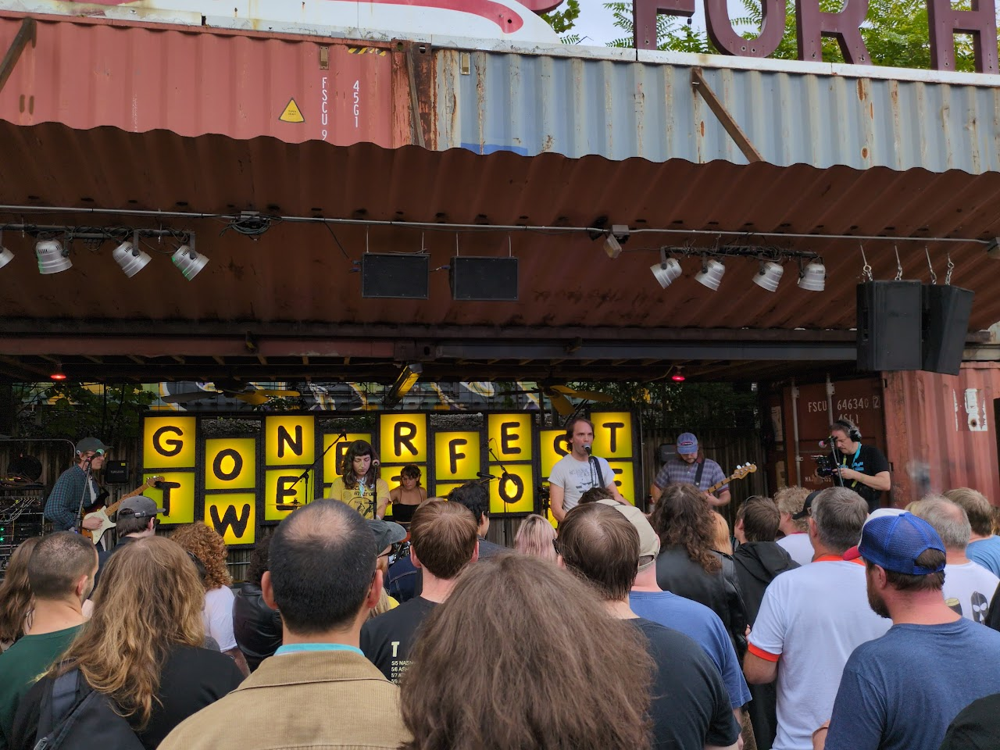
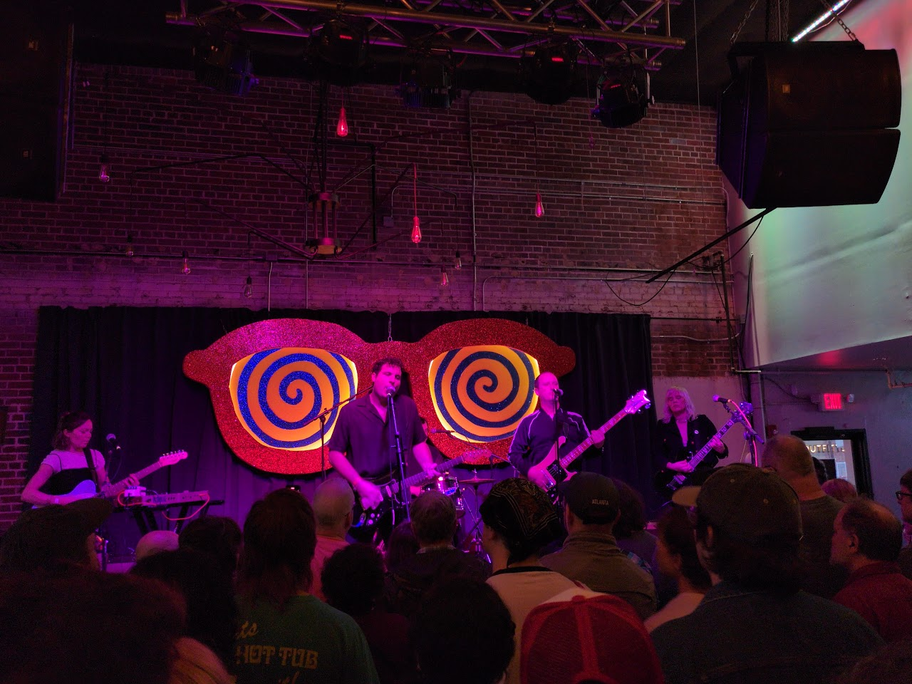

import { Image } from 'astro:assets';
import blovers from './live-better-lovers.jpg';
import idles from './live-idles.jpg';
import jamc from './live-jamc.jpg';
import ptrainer from './live-personal-trainer.jpg';
import sactivists from './live-soup-activists.jpg';
import talloys from './live-tube-alloys.jpg';

## A great year for music, a great year for live music

Here's some of my favorite releases from 2024, remember, don't look back. Dig in!

* **Acetone "I've Enjoyed As Much Of This As I Can Stand"** - this live document of Acetone served as a fine topper to the amazing [New West box set](https://newwestrecords.com/collections/acetone) of their discography, as well as being great reminder to all their fans what made them so special. A special band
* **Bad Nerves "Still Nervous"**
* **[Better Lovers](https://betterloversband.com/) "Highly irresponsible"** - maybe my favorite live set from the year, and I saw them twice, talked to Greg (singer) after a show and he is just a dynamo, from his pedigree to his showmanship - this is what hardcore/metalcore has been missing imo
                
                
Better Lovers at Delmar Hall

* **Nick Cave & The Bad Seeds "Wild God"** - going to see the master again in a few months, this is a great album
* **The Cure "Songs Of A Lost World"** - no idea how he does it, this brings me back to Disintegration, which is a great thing
* **Floating Witch's Head "Fuzzy Details"** - brilliant openers for Built to Spill, with a Philip Glass movie (Koyaanisqatsi) projected behind them. A nod to the Velvets?
* **Four Tet "Three"**
* **IDLES "TANGK"** - maybe my other favorite live set of the year, they constantly bring it. H/T to English Teacher (see below) for a great opening set
                 
                
IDLES at The Argon (Chicago)

* **Japandroids "Fate & Alcohol"**
* **The Jesus and Mary Chain "Glasgow Eyes"** - always wanted to see them, they did not disappoint, top 5 live set of the year
                 
                
Jesus & Mary Chain at Stifel Theatre

* **Les Savy Fav "OUI,LSF"**
* **The Messthetics "[The Messthetics and James Brandon Lewis](https://themessthetics.bandcamp.com/album/the-messthetics-and-james-brandon-lewis)"** - featuring Joe and Brendan, better known as the rhythm section of [Fugazi](https://en.wikipedia.org/wiki/Fugazi)
* **Modern Life Is War "Tribulation Workshops"** - it's an EP but it's what I listened to most this year. Fantastic record, and I just missed seeing them as they cancelled their show here. Next time
         
                
                
Sack put on such a great show at the Sinkhole

* **Osees "SORCS 80"** - back to their more garagy/punk sound, I approve
* **[Personal Trainer](https://personaltrainer.bandcamp.com/) "[Still Willing](https://personaltrainer.bandcamp.com/album/still-willing)"** - from The Netherlands, I saw them in Copenhagen at a small Christiana concert venue, which I now love
         
                
                
Personal Trainer at Loppen (Copenhagen, Denmark)

* **Jeff Parker ETA IVtet "The Way Out of Easy"** - more great jazz, this time off the court
* **Shellac "To All Trains"** [RIP Steve Albini](https://en.wikipedia.org/wiki/Steve_Albini) - they'll never be anyone like him. What a huge impact he had on music that I love, from PJ to Weddos and beyond, not to mention Shellac, who I was lucky to see a few times.
* **The Smile "Wall of Eyes"**
* **[Soup Activists](https://soupactivists.bandcamp.com/) "[Mummy What are Flowers For?](https://soupactivists.bandcamp.com/album/mummy-what-are-flowers-for)"** - a Saint Louis band that floored me when they opened for [Sweeping Promises](https://sweepingpromises.com/) last year, then they actually recorded this in Kansas with Sweeping Promises. Sharp stuff this
         
                
                
Soup Activists (Saint Louis) at Gonerfest 21 (Memphis)

* **[Superposition "II"](https://wejazzrecords.bandcamp.com/album/ii-2)** - more awesome modern jazz from Finland, thanks [We Jazz](https://wejazzrecords.bandcamp.com/), hope to attend your fest soon!
* **Tycho "Infinite Health"**
* **Tube Alloys "Evil Angels"** - great rock and roll from LA
         
                
                
Tube Alloys at Gonerfest 21 (Memphis)

* **Touché Amoré "Spiral in a Straight Line"** - well they didn't stand on ceremony with this release, wow
* **Gillian Welch & David Rawlings "Woodland"** - a great return to form from these legends of the (modern) genre

## Honerable Mentions

Things I think are worth checking out, who knows, maybe they'll catch fire later.

* **Adrianne Lenker "Bright Future"**
* **DIIV "Frog in Boiling Water"**
* **[English Teacher](https://www.englishteacherband.com/) "This Could Be Texas"** - strong opening set for IDLES (Chicago) helped to lesson my "This could be Dry Cleaning" feeling about them
* **Godspeed You! Black Emperor "NO TITLE AS OF 13 FEBRUARY 2024 28,340 DEAD"**
* **Fontaines D.C. "Romance"** - I never hear a bad song from these folks
* **Kim Gordon "The Collective"** - still don't love her solo stuff, but I'm giving it time
* **[Jamie XX "In Waves"](https://jamiexx.bandcamp.com/album/in-waves)** - from the beats/music creator of The xx
* **Lip Critic "Hex Dealer"**
* **Mk.gee "Two Star & the Dream Police"** - what?
* **Rosali "Bite Down"**
* **The Smile "Cutouts"** - love the consistency and the pace of the releases

## Parting Thoughts

Nothing stays the same, and I still love, love, love discovering new bands that light my fire. Here's to next year!
